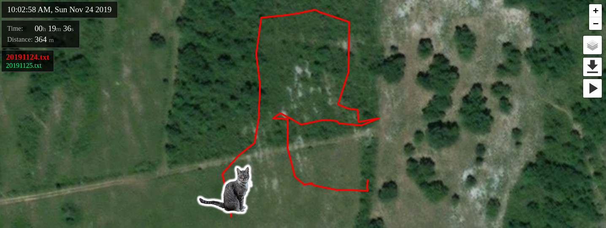
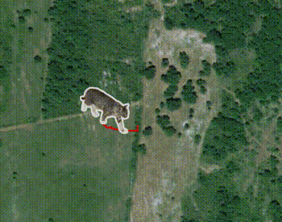

# Catographer
A web page that plays GPS logs recorded by some logger device:
* local webpage with js
* local log text files
* internet connection is required to pull js libs and map tiles

## Demo
[Demo](https://okdzhimiev.github.io/catographer/index.html?path=demo)

## Screenshots



## Software
### Requirements
* **for hosting:** webserver installed, e.g. Apache or Node
* **for viewing:** more or less up-to-date browser

### Instructions for Apache
* clone the project
* put log files into *logs/* directory (see log file format below)
* install Apache and link the project to its root:
```sh
~$ sudo apt install apache2
~$ sudo ln -sf <project-path> /var/www/html/somename
```
* browser (on any device in the network):

`http://<host-ip-or-hostname>/somename`

### Details
#### GPS log file example
```sh
...
$GPRMC,,V,,,,,,,,,,N*53
$GPRMC,,V,,,,,,,,,,N*53
$GPRMC,,V,,,,,,,,,,N*53
$GPRMC,,V,,,,,,,,,,N*53
$GPRMC,164322.00,A,4430.47468,N,00152.18748,E,0.085,,241119,,,
$GPRMC,164353.00,A,4430.47285,N,00152.18733,E,0.205,,241119,,,
$GPRMC,164424.00,A,4430.47163,N,00152.18751,E,0.416,,241119,,,
...
```
Notes:
* Each single line is a single GPS sentence (GPS logger was setup to log it in that way)
* when GPS receiver is not 'locked' the data can be empty like the first 4 lines
* only RMC sentences are used, others (like GGA) are ignored - better to filter those out

## Hardware: GPS Logger
Any COTS or DIY device that is:
* not too heavy
* not too bulky
* with internal storage and ability to write data from GPS receiver to a plain text file

### COTS
No ads.

### DIY
**BOM:**
* ESP8266 D1 mini (comes with 4MB flash)
* Battery shield for D1 mini (not drawing power directly from the battery)
* Small GPS receiver (serial interface required, i.e. TX/RX wires)
* Battery, rated 3.3V, 290mAh

**Notes:**
* Some soldering is required:
  * VCC/GND wires
  * disconnectable battery
  * GPS TX to ESP GPIO
  * ESP Deep Sleep enabling
* The GPS Logger came out light but a bit too bulky. Went ahead with testing anyways - the **asset** didn't lose it.
* Power saving - deep sleep for ESP, while GPS is always on - 3 hours of work with a ~30s interval between the records.

**Room for improvement:**
* Can easily be made smaller (~2x times) in dimensions: move away from D1 mini and the battery shield.
* Implement GPS power saving programmaticaly (if GPS module supports it) or by ESP's GPIO.
